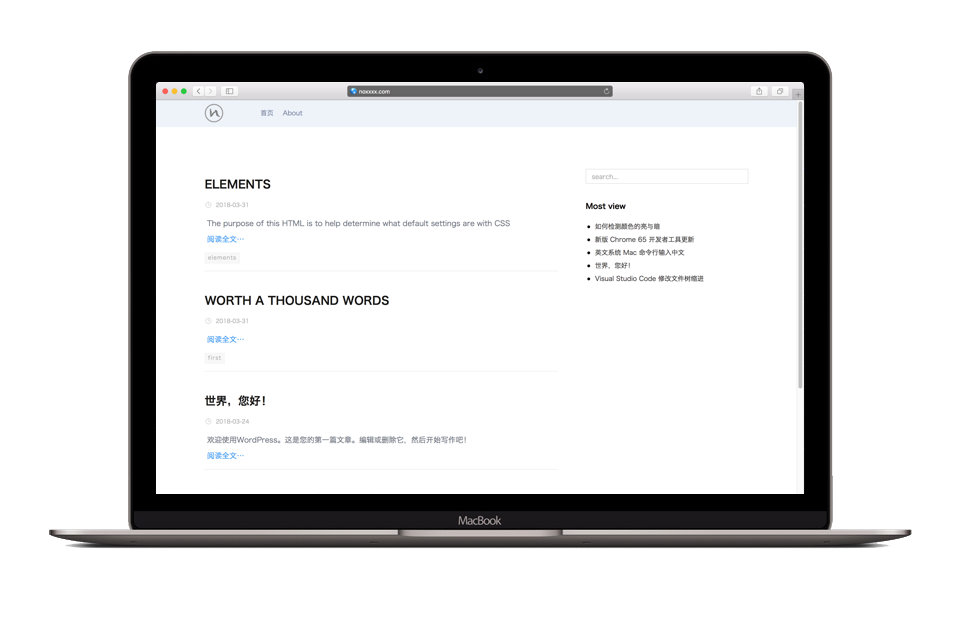

# wordpress theme ⚡ smoke

Language: 中文

wordpress 主题: smoke, 性冷淡风格，极简，适合用来写文章的朋友👭。

怎么看待极简：
> 访问深度只有一层，用户只需要一次操作就可以找到想要的东西，所以不支持二级菜单，文章页-列表页-标签-文章页 这样的层级。

## 特点

[x] 简洁高效,精简css,js

[x] 去除引用Google Fonts

[x] 引用国内Gravatar镜像

[x] 自带图片Lazyload

[x] 引入主题框架后台实现自定义配置 

[x] 全局统一使用主题自带jQuery

[x] 去除WordPress在主题中注入的冗余代码

[x] 禁用WordPress自带emoji

[x] 自带阅读统计

[x] 自带分页

[x] 自带点赞功能

[x] 自带图片点击缩放插件

[x] markdown 样式可轻松替换

[x] 移动端适配

[x] SEO支持良好

## security

[x] 禁止 WordPress 检查更新

## Browsers support 

|  IE / Edge |  Firefox |  Chrome |  Safari |  Opera |  Vivaldi |
| --------- | --------- | --------- | --------- | --------- | --------- |
| IE11, Edge| last 2 versions| last 2 versions| last 2 versions| last 2 versions| last 2 versions

## demo

[see the website](https://www.noxxxx.com)

